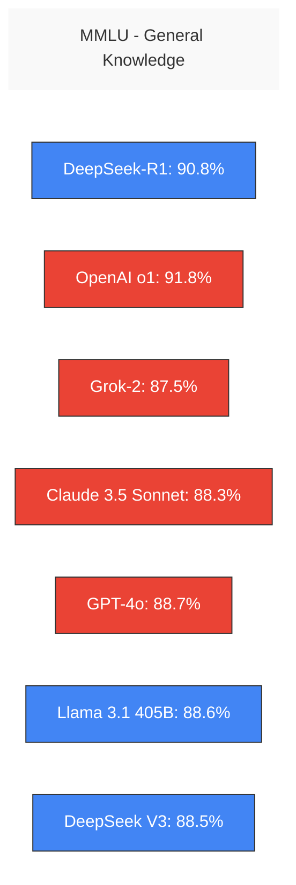
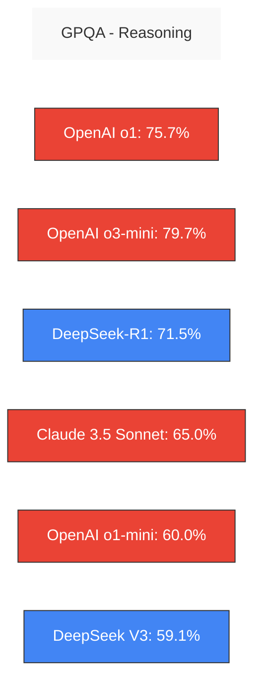
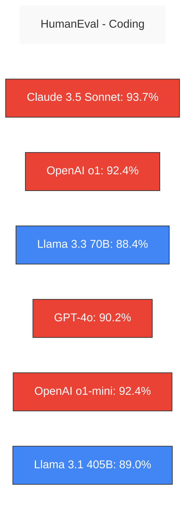
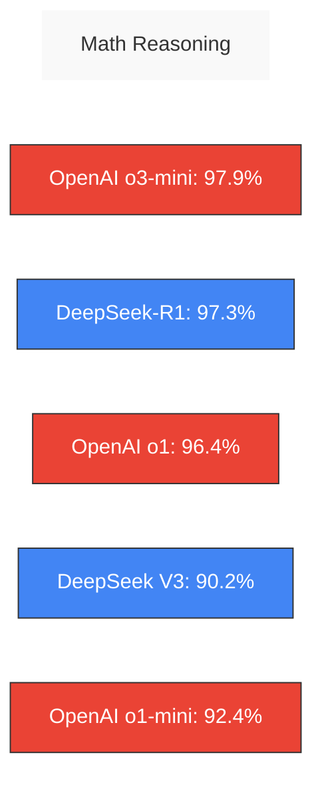
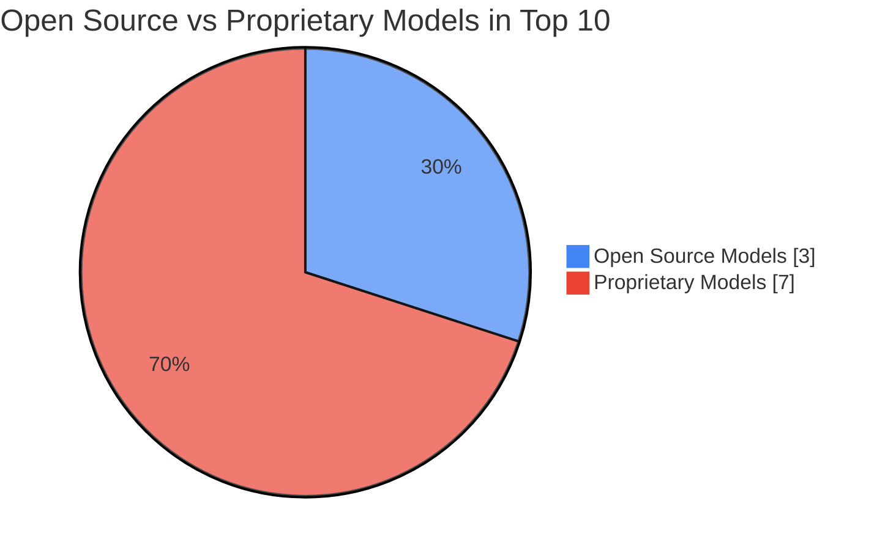

# 📊 LLM Performance Benchmarks


This page provides a comprehensive comparison of performance benchmarks across leading Large Language Models, including both open-source and proprietary options. Our benchmarks evaluate models across general knowledge, reasoning, coding, mathematics, tool use, and multilingual capabilities.

## 📈 Overall Performance

The chart below shows the overall average performance across all benchmark categories. Higher percentages indicate better performance.


## 🔍 Key Benchmark Categories

### MMLU (General Knowledge)



### GPQA (Reasoning)



### HumanEval (Coding)



### Math Reasoning



### Tool Use & Multilingual Performance

```mermaid
graph LR
    title[BFCL (Tool Use) & MGSM (Multilingual)]
    style title fill:#f9f9f9,stroke:#333,stroke-width:0px
    
    subgraph Tool Use
    Claude35S_T[Claude 3.5 Sonnet: 90.2%]:::prop
    Llama31_405b_T[Llama 3.1 405B: 88.5%]:::open
    Claude3O_T[Claude 3 Opus: 88.4%]:::prop
    end

    subgraph Multilingual
    OpenAI_o3mini_M[OpenAI o3-mini: 92.0%]:::prop
    Claude35S_M[Claude 3.5 Sonnet: 91.6%]:::prop
    Llama31_405b_M[Llama 3.1 405B: 91.6%]:::open
    Llama33_70b_M[Llama 3.3 70B: 91.1%]:::open
    end
    
    classDef open fill:#4285F4,stroke:#333,stroke-width:1px,color:white;
    classDef prop fill:#EA4335,stroke:#333,stroke-width:1px,color:white;
```

## 📋 Complete Benchmark Data

### Overall Performance

| Model | Average | MMLU (General) | GPQA (Reasoning) | HumanEval (Coding) | Math | BFCL (Tool Use) | MGSM (Multilingual) | Type |
|:------|:--------|:---------------|:-----------------|:-------------------|:-----|:----------------|:--------------------|:-----|
| OpenAI o1 | 85.39% | 91.8% | 75.7% | 92.4% | 96.4% | 66.73% | 89.3% | Proprietary |
| Claude 3.5 Sonnet | 84.5% | 88.3% | 65% | 93.7% | 78.3% | 90.2% | 91.6% | Proprietary |
| GPT-4o | 80.5% | 88.7% | 53.6% | 90.2% | 76.6% | 83.59% | 90.5% | Proprietary |
| Llama 3.1 405B | 80.4% | 88.6% | 51.1% | 89% | 73.8% | 88.5% | 91.6% | Open Source |
| OpenAI o1-mini | 80.07% | 85.2% | 60% | 92.4% | 90% | 62.89% | 89.9% | Proprietary |
| GPT-Turbo | 78.1% | 86.5% | 48% | 87.1% | 72.6% | 86% | 88.5% | Proprietary |
| Claude 3 Opus | 76.7% | 85.7% | 50.4% | 84.9% | 60.1% | 88.4% | 90.7% | Proprietary |
| DeepSeek V3 | 76.24% | 88.5% | 59.1% | 82.6% | 90.2% | 57.23% | 79.8% | Open Source |
| GPT-4 | 75.5% | 86.4% | 41.4% | 86.6% | 64.5% | 88.3% | 85.9% | Proprietary |
| Llama 3.1 70B | 75.5% | 86% | 46.7% | 80.5% | 68% | 84.8% | 86.9% | Open Source |
| Llama 3.3 70B | 74.5% | 86% | 48% | 88.4% | 77% | 77.5% | 91.1% | Open Source |
| Gemini 1.5 Pro | 74.1% | 85.9% | 46.2% | 71.9% | 67.7% | 84.35% | 88.7% | Proprietary |
| Claude 3.5 Haiku | 68.3% | 65% | 41.6% | 88.1% | 69.4% | 60% | 85.6% | Proprietary |
| Gemini 1.5 Flash | 66.7% | 78.9% | 39.5% | 71.5% | 54.9% | 79.88% | 75.5% | Proprietary |
| Claude 3 Haiku | 62.9% | 75.2% | 35.7% | 75.9% | 38.9% | 74.65% | 71.7% | Proprietary |
| Llama 3.1 8B | 62.6% | 73% | 32.8% | 72.6% | 51.9% | 76.1% | 68.9% | Open Source |
| GPT-3.5 Turbo | 59.2% | 69.8% | 30.8% | 68% | 34.1% | 64.41% | 56.3% | Proprietary |

### Models with Incomplete Benchmark Data

| Model | MMLU | GPQA | HumanEval | Math | BFCL | MGSM | Type |
|:------|:-----|:-----|:----------|:-----|:-----|:-----|:-----|
| Gemini 2.0 Flash | 76.4% | 62.1% | - | 89.7% | - | - | Proprietary |
| AWS Nova Micro | 77.6% | 40% | 81.1% | 69.3% | 56.2% | - | Proprietary |
| AWS Nova Lite | 80.5% | 42% | 85.4% | 73.3% | 66.6% | - | Proprietary |
| AWS Nova Pro | 85.9% | 46.9% | 89% | 76.6% | 68.4% | - | Proprietary |
| GPT-4o mini | 82% | 40.2% | 87.2% | 70.2% | - | 87% | Proprietary |
| Gemini Ultra | 83.7% | 35.7% | - | 53.2% | - | 79% | Proprietary |
| OpenAI o3-mini | 86.9% | 79.7% | - | 97.9% | - | 92% | Proprietary |
| Qwen2.5-72B | 70.2% | 49% | 88% | 85% | 61.31% | - | Open Source |
| DeepSeek-R1 | 90.8% | 71.5% | - | 97.3% | - | - | Open Source |
| Grok-2 | 87.5% | 56% | 88.4% | 76.1% | - | - | Proprietary |
| Grok-2 mini | 86.2% | 51% | 85.7% | 73% | - | - | Proprietary |

## 🌟 Open Source vs Proprietary Performance



## 🔬 Benchmark Descriptions

- **MMLU**: Multi-task Language Understanding - tests knowledge across 57 subjects
- **GPQA**: Graduate-level Professional QA - tests complex scientific reasoning
- **HumanEval**: Tests code generation capabilities with functional correctness
- **Math**: Tests mathematical problem-solving and reasoning
- **BFCL**: Tests ability to use tools and follow complex instructions
- **MGSM**: Tests math problem-solving across multiple languages


---

*Note: This comparison is current as of March 2025. Performance metrics may change as models continue to evolve and improve.*

## 🔗 Related Resources

- [Model Series Documentation](../models/)
- [Hardware Requirements](../hardwares/)