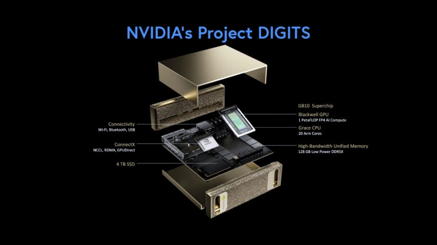

# NVIDIA Project DIGITS

NVIDIA Project DIGITS is a cutting-edge portable AI system designed for high-performance edge computing. Powered by the NVIDIA GB10 Grace Blackwell Superchip, it delivers data center-class AI performance in a portable form factor.

## Specifications

| Component | Specification |
|:----------|:--------------|
| **System on Chip** | NVIDIA GB10 Grace Blackwell Superchip |
| **GPU** | NVIDIA Blackwell |
| **CPU** | 20-core Arm® |
| **AI Performance** | 1 PFLOP FP4 (≈ 4x RTX 4090s) |
| **Memory** | 128 GB LPDDR5x coherent unified system memory (bandwidth ?)|
| **Connectivity** | 4x USB4 Type C, Bluetooth |
| **Networking** | ConnectX, Wi-Fi, Ethernet |
| **Storage** | Up to 4 TB NVMe M.2 with self-encryption |
| **Display Output** | 1x HDMI 2.1a |
| **Power** | Standard wall outlet |
| **OS** | NVIDIA DGX™ Base OS, Ubuntu Linux |

## Key Features

### Unified Memory Architecture

The Project DIGITS system features a unified memory architecture that allows the CPU and GPU to access the same physical memory, eliminating costly data transfers between separate memory pools.

### Portable Form Factor

Despite its impressive performance capabilities, Project DIGITS comes in a portable form factor that can be easily transported, making it ideal for:

- Field research
- On-site AI demonstrations
- Mobile development workstations
- Edge deployment scenarios

### Enterprise-Grade Security

With built-in self-encrypting storage and advanced security features from the NVIDIA DGX Base OS, Project DIGITS is designed with enterprise-grade security in mind.

### Development Environment

Project DIGITS comes with a full Ubuntu Linux-based operating system, providing a familiar and powerful development environment with access to:

- CUDA and TensorRT
- Popular AI frameworks like PyTorch and TensorFlow
- Triton Inference Server
- NVIDIA AI Enterprise software stack

## Use Cases

### On-Device AI Inference

Project DIGITS is ideal for running AI inference workloads locally, with sufficient performance to run sophisticated models simultaneously. This makes it perfect for:

- Private AI deployment where data cannot leave the device
- Offline AI capabilities in disconnected environments
- Low-latency AI applications

### AI Research and Development

The combination of powerful hardware and a full development environment makes Project DIGITS an excellent platform for AI research and development, supporting:

- Model fine-tuning
- AI application development and testing
- Experimentation with multiple models

### Edge AI Deployment

For organizations looking to deploy AI at the edge without the limitations of traditional edge devices, Project DIGITS offers data center-class performance in a portable package, enabling:

- On-site natural language processing
- Local computer vision applications
- Edge analytics with AI assistance