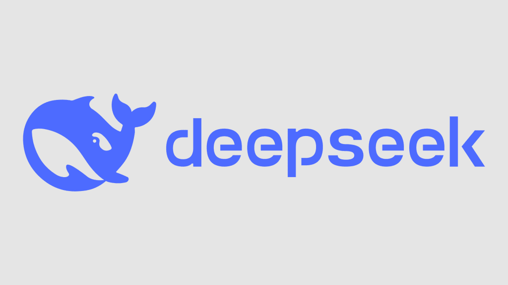

# DeepSeek Model Series

DeepSeek is a series of advanced large language models developed by DeepSeek AI. The series spans from lightweight models suitable for edge devices to massive models designed for cutting-edge research and enterprise applications.

## Model Versions Overview

| Model | Release Date | Parameter Size | Activation Parameters | Key Features | Input Modalities | Output Modalities |
|:------|:-------------|:---------------|:---------------------|:-------------|:-----------------|:------------------|
| **DeepSeek-R1** | 2025 | 671B | 37B | For math modeling, code generation etc. | Text | Text |
| **DeepSeek-V3** | 2024 | 671B | 37B | Latest generation with advanced reasoning capabilities | Text | Text |
| **DeepSeek-V2** | 2023 | 236B | 21B | Enhanced context handling and instruction following | Text | Text |
| **DeepSeek-V2-Lite** | 2023 | 15.7B | 2.4B | Optimized for efficiency while maintaining strong capabilities | Text | Text |
| **DeepSeek 67B** | 2023 | 67B | 67B | High-capacity model for complex reasoning and generation | Text | Text |
| **DeepSeek 7B** | 2022 | 7B | 7B | Balanced performance for general-purpose applications | Text | Text |
| **DeepSeek 1.3B** | 2022 | 1.3B | 1.3B | Lightweight model for constrained environments | Text | Text |

## Hardware Requirements

| Model | Parameter Size | Activation Parameters | Precision | VRAM Required | System RAM Required |
|:------|:---------------|:----------------------|:----------|:--------------|:--------------------|
| **DeepSeek-R1** | 671B | 37B | FP16 | ~1 TB | ~2 TB |
| **DeepSeek-V3** | 671B | 37B | FP16 | ~1 TB | ~2 TB |
| **DeepSeek-V2** | 236B | 21B | FP16 | ~472 GB | ~900 GB |
| **DeepSeek-V2-Lite** | 15.7B | 2.4B | FP16 | ~31 GB | ~62 GB |
| **DeepSeek 67B** | 67B | 67B | FP16 | ~134 GB | ~268 GB |
| **DeepSeek 7B** | 7B | 7B | FP16 | ~14 GB | ~28 GB |
| **DeepSeek 1.3B** | 1.3B | 1.3B | FP16 | ~2.6 GB | ~5.2 GB |

### DeepSeek-R1-Distill Models

| Parameter Size | Precision | VRAM Required | System RAM Required | Notes |
|:---------------|:----------|:--------------|:--------------------|:------|
| **1.5B** | FP16 | ~3 GB | ~6 GB | Runs on entry-level GPUs and mobile devices |
| **7B** | FP16 | ~14 GB | ~28 GB | Compatible with consumer GPUs (e.g., RTX 3080, 4070) |
| **8B** | FP16 | ~16 GB | ~32 GB | Requires mid-range consumer GPUs with ≥16GB VRAM |
| **14B** | FP16 | ~28 GB | ~56 GB | Needs high-end GPUs (e.g., RTX 4090, A5000) |
| **32B** | FP16 | ~64 GB | ~128 GB | Requires professional-grade GPUs or multi-GPU setup |
| **70B** | FP16 | ~140 GB | ~280 GB | Needs multi-GPU deployment (e.g., 2-4× A100 or H100) |

## Model Architecture

DeepSeek models are based on the transformer architecture with several key innovations:

- **Mixture of Experts (MoE)**: DeepSeek-V2 and V3 utilize MoE architecture to achieve significantly higher effective parameter counts while keeping compute requirements manageable
- **Advanced Activations**: Specialized activation functions for improved training stability and inference quality
- **Efficient Attention Mechanisms**: Modified attention mechanisms to better handle long-range dependencies
- **Optimized Training Methodology**: Custom pre-training curricula and fine-tuning approaches

## Performance Benchmarks
tbd