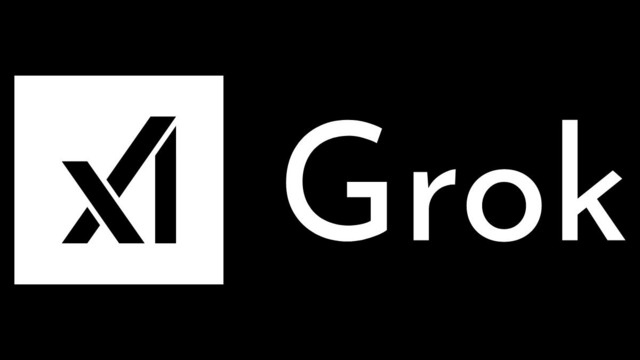

# Grok Model Series

Grok is a series of advanced large language models developed by xAI. The models feature innovative architectures like Mixture of Experts (MoE) and are designed to push the boundaries of AI capabilities in reasoning, multimodal understanding, and knowledge application.

## Model Versions Overview

Currently only Grok 1 is open-sourced.

| Model | Release Date | Parameter Size | Key Features | Input Modalities | Output Modalities |
|:------|:-------------|:---------------|:-------------|:-----------------|:------------------|
| **Grok-1** | March 2024 | 314B | Initial release with a mixture of experts (MoE) architecture, enabling efficient scaling | Text | Text |

## Hardware Requirements

| Model | Parameter Size | Precision | VRAM Required | System RAM Required | Notes |
|:------|:---------------|:----------|:--------------|:--------------------|:------|
| **Grok-1** | 314B | FP16 | ~628 GB | ~1256 GB | Requires large-scale distributed systems |

## Model Architecture

Grok models are built on advanced transformer-based architectures with several pioneering features:

- **Mixture of Experts (MoE)**: Employs specialized expert networks that are selectively activated based on input, allowing for massive parameter scaling without proportional compute increases
- **Advanced Attention Mechanisms**: Innovative attention designs for handling complex relationships in data
- **Multimodal Integration**: Later versions incorporate sophisticated mechanisms for processing and understanding multiple modalities
- **Scaling Methodology**: Unique approach to scaling model size and training compute while maintaining efficiency

## Performance Benchmarks
tbd