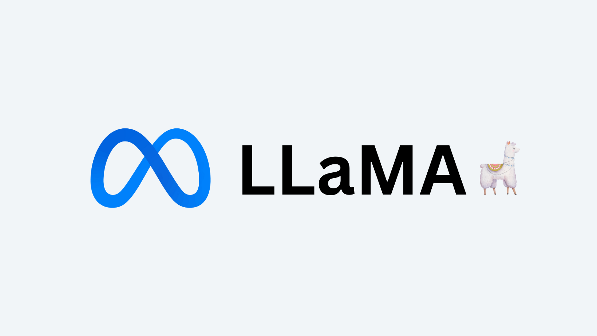

# LLaMA Model Series

LLaMA (Large Language Model Meta AI) is a series of open-source large language models developed by Meta AI. This family has evolved through multiple generations, each bringing significant improvements in capabilities and performance.

## Model Versions Overview

| Generation | Release Date | Key Improvements | Parameter Sizes | Input Modalities | Output Modalities |
|:-----------|:-------------|:-----------------|:----------------|:-----------------|:------------------|
| **LLaMA 1** | March 2023 | First public release | 7B, 13B, 30B, 65B | Text | Text |
| **LLaMA 2** | July 2023 | Longer context, improved instruction following | 7B, 13B, 70B | Text | Text |
| **Code LLaMA** | August 2023 | Specialized for code generation | 7B, 13B, 34B, 70B | Text | Text |
| **LLaMA 3** | April 2024 | Significant quality improvements | 8B, 70B | Text | Text, Code |
| **LLaMA 3.1** | July 2024 | Enhanced reasoning, longer context | 8B, 70B, 405B | Multilingual Text | Text, Code |
| **LLaMA 3.2 Quantized** | September 2024 | A new mix of publicly available online data. | 1B, 3B | Multilingual Text, Code | Multilingual Text, Code |
| **LLaMA 3.2 Vision** | September 2024 | A multimodal large language models. | 11B, 90B | Text, Image | Text |

## Hardware Requirements

### LLaMA 1

| Parameter Size | Precision | VRAM Required | System RAM Required | Notes |
|:---------------|:----------|:--------------|:--------------------|:------|
| **7B** | FP16 | ~14 GB | ~28 GB | Consumer-grade GPUs (e.g. RTX 3090) can run this |
| **13B** | FP16 | ~26 GB | ~52 GB | Requires high‑end GPUs (e.g. A100 40GB) |
| **33B** | FP16 | ~60 GB | ~120 GB | Likely needs multi‑GPU or a high‑end single GPU |
| **65B** | FP16 | ~130 GB | ~260 GB | Typically deployed on multi‑GPU setups |

### LLaMA 2

| Parameter Size | Precision | VRAM Required | System RAM Required | Notes |
|:---------------|:----------|:--------------|:--------------------|:------|
| **7B** | FP16 | ~14 GB | ~28 GB | Similar to LLaMA 1; commercial usage permitted |
| **13B** | FP16 | ~26 GB | ~52 GB | As above |
| **70B** | FP16 | ~140 GB | ~280 GB | Typically requires multi-GPU setups |

### Code LLaMA

| Parameter Size | Precision | VRAM Required | System RAM Required | Notes |
|:---------------|:----------|:--------------|:--------------------|:------|
| **7B** | FP16 | ~14 GB | ~28 GB | Specially tuned for code tasks |
| **13B** | FP16 | ~26 GB | ~52 GB | |
| **34B** | FP16 | ~68 GB | ~136 GB | |
| **70B** | FP16 | ~140 GB | ~280 GB | Requires multi‑GPU or heavy quantization |

### LLaMA 3

| Parameter Size | Precision | VRAM Required | System RAM Required | Notes |
|:---------------|:----------|:--------------|:--------------------|:------|
| **8B** | FP16 | ~16 GB | ~32 GB | Slightly higher requirements due to architecture changes |
| **70B** | FP16 | ~140 GB | ~280 GB | High‑performance, multi‑GPU recommended |

### LLaMA 3.1

| Parameter Size | Precision | VRAM Required | System RAM Required | Notes |
|:---------------|:----------|:--------------|:--------------------|:------|
| **8B** | FP16 | ~16 GB | ~32 GB | Suitable for consumer‑grade GPUs |
| **70B** | FP16 | ~140 GB | ~280 GB | |
| **405B** | FP16 | ~810 GB | ~1620 GB | Massive model requiring specialized infrastructure |

### LLaMA 3.2 Quantized

| Parameter Size | Precision | VRAM Required | System RAM Required | Notes |
|:---------------|:----------|:--------------|:--------------------|:------|
| **1B** | FP16 | ~2 GB | ~4 GB | |
| **3B** | FP16 | ~6 GB | ~12 GB | |

### LLaMA 3.2 Vision

| Parameter Size | Precision | VRAM Required | System RAM Required | Notes |
|:---------------|:----------|:--------------|:--------------------|:------|
| **11B** | FP16 | ~22 GB | ~44 GB | |
| **90B** | FP16 | ~180 GB | ~360 GB | |

## Performance Metrics
tbd