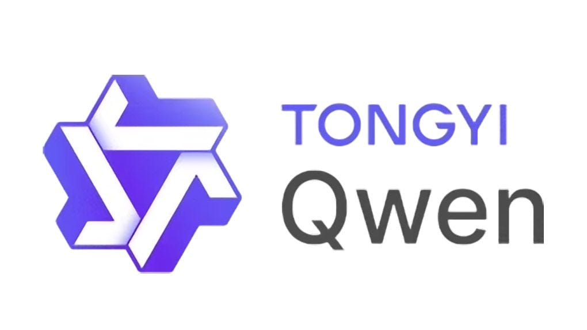

# Qwen Model Series

Qwen (通义千问) is a series of large language models developed by Alibaba Cloud. The series includes text-only models as well as multimodal variants capable of processing images and audio along with text.

## Model Versions Overview

| Model | Release Date | Parameter Size | Key Features | Input Modalities | Output Modalities |
|:------|:-------------|:---------------|:-------------|:-----------------|:------------------|
| **QwQ-32B-Preview** | November 2024 | 32B | Experimental reasoning-focused model, based on Qwen2.5, released under Apache 2.0 license with weights only (no dataset/training details), comparable to OpenAI's o1 in reasoning tasks | Text | Text |
| **Qwen2.5** | 2024 | 0.5B, 1.5B, 3B, 7B, 14B, 32B, 72B | Decoder-only dense language model, provides both base and instruction-tuned variants, pretrained on latest datasets containing up to 18 trillion tokens, with significant improvements in instruction following, long text generation, understanding structured data, and generating structured outputs | Text | Text |
| **Qwen2** | 2024 | 0.5B, 1.5B, 7B, 14B, 72B | Decoder-only dense language model supporting multilingual processing with up to 128K context length, uses Grouped-Query Attention (GQA) mechanism, optimized for inference speed and memory usage | Text | Text |
| **Qwen1.5** | 2024 | 0.5B, 1.8B, 4B, 7B, 14B, 32B, 72B, 110B | Decoder-only dense language model supporting multilingual processing with up to 32K context length, pretrained on high-quality data and instruction-tuned | Text | Text |
| **Qwen** | September 2023 | 7B, 14B, 72B | Transformer-based large language model supporting multilingual processing with 32K context length, trained on 2-3T tokens, performance comparable to Llama 2, GPT-3.5, and GPT-4 | Text | Text |
| **Qwen-VL** | August 2023 | 7B | Vision-language model integrating visual perception and language understanding, supports image description, Q&A, localization and text reading tasks, performs well on multiple visual benchmarks | Text, Image | Text |
| **Qwen-Audio** | November 2023 | 7B | Audio-language model covering over 30 tasks and various audio types including human speech, natural sounds, and music, with general audio understanding capabilities, handles multi-turn dialogues and supports various audio-centered scenarios | Text, Audio | Text |

## Hardware Requirements

### QwQ-32B-Preview
| Parameter Size | Precision | VRAM Required | System RAM Required | Notes |
|:---------------|:----------|:--------------|:--------------------|:------|
| **32B** | FP16 | ~64 GB | ~128 GB | Likely needs multi-GPU setup, focused on reasoning tasks |

### Qwen2.5
| Parameter Size | Precision | VRAM Required | System RAM Required | Notes |
|:---------------|:----------|:--------------|:--------------------|:------|
| **0.5B** | FP16 | ~1 GB | ~2 GB | Suitable for edge devices and mobile applications |
| **1.5B** | FP16 | ~3 GB | ~6 GB | Entry-level GPUs can run this |
| **3B** | FP16 | ~6 GB | ~12 GB | Mid-range consumer GPUs can run this |
| **7B** | FP16 | ~14 GB | ~28 GB | High-end consumer GPUs (e.g., RTX 3090) can run this |
| **14B** | FP16 | ~28 GB | ~56 GB | Requires high-end GPUs (e.g., A100 40GB) |
| **32B** | FP16 | ~64 GB | ~128 GB | Likely needs multi-GPU setup |
| **72B** | FP16 | ~144 GB | ~288 GB | Requires multi-GPU setups |

### Qwen2
| Parameter Size | Precision | VRAM Required | System RAM Required | Notes |
|:---------------|:----------|:--------------|:--------------------|:------|
| **0.5B** | FP16 | ~1 GB | ~2 GB | Suitable for edge devices and mobile applications |
| **1.5B** | FP16 | ~3 GB | ~6 GB | Entry-level GPUs can run this |
| **7B** | FP16 | ~14 GB | ~28 GB | High-end consumer GPUs can run this |
| **14B** | FP16 | ~28 GB | ~56 GB | Requires high-end GPUs |
| **72B** | FP16 | ~144 GB | ~288 GB | Requires multi-GPU setups |

### Qwen1.5
| Parameter Size | Precision | VRAM Required | System RAM Required | Notes |
|:---------------|:----------|:--------------|:--------------------|:------|
| **0.5B** | FP16 | ~1 GB | ~2 GB | Suitable for edge devices and mobile applications |
| **1.8B** | FP16 | ~3.6 GB | ~7.2 GB | Entry-level GPUs can run this |
| **4B** | FP16 | ~8 GB | ~16 GB | Mid-range consumer GPUs can run this |
| **7B** | FP16 | ~14 GB | ~28 GB | High-end consumer GPUs can run this |
| **14B** | FP16 | ~28 GB | ~56 GB | Requires high-end GPUs |
| **32B** | FP16 | ~64 GB | ~128 GB | Likely needs multi-GPU setup |
| **72B** | FP16 | ~144 GB | ~288 GB | Requires multi-GPU setups |
| **110B** | FP16 | ~220 GB | ~440 GB | Requires specialized multi-GPU infrastructure |

### Qwen
| Parameter Size | Precision | VRAM Required | System RAM Required | Notes |
|:---------------|:----------|:--------------|:--------------------|:------|
| **7B** | FP16 | ~14 GB | ~28 GB | Consumer-grade GPUs (e.g., RTX 3090) can run this |
| **14B** | FP16 | ~28 GB | ~56 GB | Requires high-end GPUs (e.g., A100 40GB) |
| **72B** | FP16 | ~144 GB | ~288 GB | Typically requires multi-GPU setups |

### Qwen-VL
| Parameter Size | Precision | VRAM Required | System RAM Required | Notes |
|:---------------|:----------|:--------------|:--------------------|:------|
| **7B** | FP16 | ~14 GB | ~28 GB | Additional VRAM may be needed for processing images |

### Qwen-Audio
| Parameter Size | Precision | VRAM Required | System RAM Required | Notes |
|:---------------|:----------|:--------------|:--------------------|:------|
| **7B** | FP16 | ~14 GB | ~28 GB | Additional VRAM may be needed for processing audio |

## Model Architecture

Qwen models incorporate several advanced architectural features:

- **Decoder-Only Architecture**: All models in the Qwen family use a decoder-only transformer architecture
- **Multilingual Support**: Comprehensive support for multiple languages, with strong performance in Chinese and English
- **Extended Context Windows**: Support ranging from 32K tokens (Qwen1.5) to 128K tokens (Qwen2)
- **Grouped-Query Attention (GQA)**: Implemented in Qwen2 to optimize inference speed and memory usage
- **Multimodal Processing**: Specialized variants for handling different modalities (text, images, audio)
- **Vision-Language Integration**: Qwen-VL features advanced vision-language alignment techniques
- **Audio Understanding**: Qwen-Audio includes sophisticated audio encoding and processing capabilities
- **Large-Scale Training**: Newest models (Qwen2.5) trained on up to 18 trillion tokens
- **Instruction Tuning**: Models are available in both base and instruction-tuned variants
- **Structured Data Handling**: Later models (Qwen2.5) show improved capabilities in understanding and generating structured data

## Performance Benchmarks
tbd